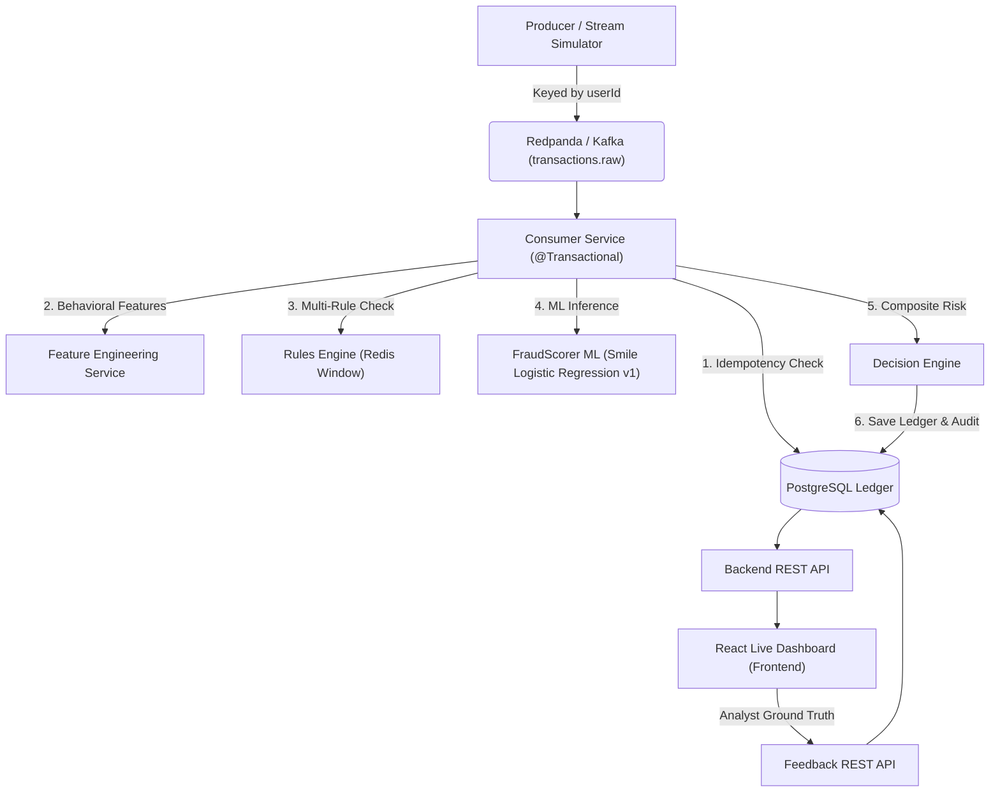

# FinXGuard: Real-Time Event-Driven Hybrid Fraud Prevention Platform

**FinXGuard** is a high-throughput, low-latency, real-time event-driven fraud prevention platform built with Java, Spring Boot, Apache Kafka (Redpanda), Redis, PostgreSQL, Smile Machine Learning, and React. It processes live credit card transaction streams, applies real-time behavioral feature engineering, evaluates multi-rule velocity and anomaly checks via Redis, scores transactions using a Kaggle-trained sub-microsecond Smile Machine Learning model ($V_1..V_{28}$, Amount), evaluates composite risk scores (0–100) with explainable decision reasons (`APPROVED`, `REVIEW`, `BLOCKED`), and records transactions into an ACID-compliant PostgreSQL audit ledger. Analysts can interact with a live React Dashboard to monitor transactions, inject test events, and submit ground-truth feedback for model retraining.

---

## 🚀 Key Objectives & Performance Highlights

* **Hybrid Decision Engine:** Combines Machine Learning fraud probability (50% weight) with Object-Oriented multi-rule velocity checks (50% weight) to produce a unified Risk Score (0–100) and actionable decisions (`APPROVED`, `REVIEW`, `BLOCKED`).
* **Explainable AI & Auditability:** Every decision stores granular human-readable reasons (e.g. `HIGH_VELOCITY (+30)`, `UNUSUAL_AMOUNT (+25)`, `NEW_COUNTRY (+25)`, `HIGH_ML_FRAUD_PROB (+45)`) in PostgreSQL.
* **Sub-Microsecond ML Inference:**
  * **Median Latency:** `0.200 µs`
  * **P99 Latency:** `0.600 µs`
* **Classpath Model Resolution:** Models are embedded directly in JAR artifacts (`/model/fraud_model.ser`) with fallback path resolution, eliminating working directory path errors.
* **Stratified ML Training:** Uses stratified train/test splitting (80/20) and undersampling on Kaggle dataset (`creditcard.csv`) evaluating Precision, Recall, and F1 score.
* **Analyst Feedback Loop:** Supports ground-truth feedback recording (`fraud_feedback` table) via REST API and React Dashboard modal for model retraining workflows.
* **React Live Dashboard:** Real-time UI with KPI stat cards, interactive simulator, decision distribution charts, and searchable audit ledger.

---

## 🏗️ System Architecture & Workflow



### Component Architecture

1. **Producer Service (`producer-service`)** (Port `8081`)
   * Translates payment events or Kaggle CSV rows (`creditcard.csv`) into `TransactionEvent` messages.
   * Keyed Kafka partitioning by `userId` guarantees sequential processing.
   * Exposes REST streaming endpoints (`/api/producer/transactions`, `/api/producer/stream-csv`).

2. **Rules Engine (`rules_engine`)** (Port `8083`)
   * Object-oriented rules architecture (`VelocityRule`, `AmountRule`, `DeviceRule`, `LocationRule`, `MerchantRule`).
   * Evaluates Redis 60-second fixed window velocity counters and suspicious categories (`CASINO`, `CRYPTO`, `GAMBLING`, `LUXURY_JEWELRY`, `WIRE_TRANSFER`).
   * Returns `RuleResult` DTO with composite `ruleScore` (0–100) and flagged reasons.

3. **Machine Learning Module (`ml`)**
   * Smile Logistic Regression trained on Kaggle dataset ($V_1..V_{28}$, Amount).
   * Standardizes feature scale ($Z$-score normalization) and calculates fraud probability $P(\text{fraud}) \in [0, 1]$.
   * Packaged as `fraud-ml-1.0-SNAPSHOT.jar` into local Maven repository (`~/.m2`).

4. **Consumer Service (`consumer_service`)** (Port `8082`)
   * Idempotent listener (`existsByTransactionId`).
   * Calls Rules Engine $\rightarrow$ FraudScorer ML $\rightarrow$ `DecisionEngine` $\rightarrow$ saves to PostgreSQL ledger in single `@Transactional` boundary.

5. **Analytics & Feedback Backend (`backend`)** (Port `8080`)
   * Exposes REST endpoints for overall analytics summary (`/api/analytics/summary`), status distributions, suspicious transactions, and analyst feedback submission (`/api/feedback`).

6. **React Live Dashboard (`Frontend`)** (Port `3000`)
   * Modern React 18 + Vite + Tailwind CSS dashboard.
   * Provides stat cards, event simulator, decision breakdown visualizers, audit table, and analyst ground-truth feedback modal.

---

## 📂 Project Directory Structure

```
FinXGuard/
├── backend/                            # Analytics & Feedback REST Backend
│   ├── src/main/java/com/finxguard/backend/
│   │   ├── controller/                 # AnalyticsController, TransactionController, FeedbackController
│   │   ├── model/                      # Transaction, FraudFeedback entities
│   │   ├── repository/                 # TransactionRepository, FraudFeedbackRepository
│   │   └── service/
│   └── pom.xml
│
├── consumer_service/                   # Kafka Consumer, Feature Engineering & Decision Engine
│   ├── src/main/java/com/finxguard/consumer_service/
│   │   ├── client/RuleEngineClient.java
│   │   ├── model/                      # Transaction, TransactionEvent, RuleResult DTOs
│   │   ├── repository/TransactionRepository.java
│   │   └── service/                    # KafkaConsumerService, DecisionEngine, FeatureEngineeringService
│   └── pom.xml
│
├── producer-service/                   # CSV Streamer & Kafka Event Producer
│   ├── src/main/java/com/finxguard/producer/
│   │   ├── controller/TransactionProducerController.java
│   │   ├── model/TransactionEvent.java
│   │   └── service/                    # CsvStreamProducerService, KafkaProducerService
│   └── pom.xml
│
├── rules_engine/                       # Redis OOP Multi-Rules Engine
│   ├── src/main/java/com/finxguard/rules_engine/
│   │   ├── controller/VelocityRuleController.java
│   │   ├── rule/                       # VelocityRule, AmountRule, DeviceRule, LocationRule, MerchantRule
│   │   └── service/VelocityRuleService.java
│   └── pom.xml
│
├── ml/                                 # Smile ML Engine & Model Training
│   ├── model/fraud_model.ser           # Serialized Model Bundle (weights, mean, std, threshold)
│   ├── src/main/java/com/example/     # FraudScorer, ModelBundle, LoadData, SplitData, TrainModel, SaveModel
│   └── pom.xml
│
├── Frontend/                           # React 18 Live Dashboard
│   ├── src/
│   │   ├── components/                 # Navbar, StatCard, StreamControl, AnalyticsCharts, TransactionTable, FeedbackModal
│   │   ├── App.jsx
│   │   └── main.jsx
│   ├── index.html
│   ├── vite.config.js
│   └── package.json
│
├── database/
│   └── schema.sql                      # PostgreSQL schema (transactions, fraud_feedback)
│
├── docker/
│   └── docker-compose.yml              # Container setup (PostgreSQL, Redpanda, Redis)
│
└── README.md                           # Comprehensive documentation
```

---

## 🛠️ Getting Started & Execution Guide

### 1. Start Docker Infrastructure
Run Kafka (Redpanda), Redis, and PostgreSQL containers:
```bash
docker-compose -f docker/docker-compose.yml up -d
```

### 2. Build & Install ML Artifact
Install `fraud-ml` into your local Maven cache:
```bash
cd ml
..\consumer_service\mvnw.cmd clean install -f pom.xml
```

### 3. Build All Microservices
Compile all backend microservices:
```bash
cd rules_engine && .\mvnw.cmd clean compile
cd ..\consumer_service && .\mvnw.cmd clean compile
cd ..\producer-service && .\mvnw.cmd clean compile
cd ..\backend && .\mvnw.cmd clean compile
```

### 4. Run Microservices
Launch services in separate terminal windows:
* **Rules Engine:** `cd rules_engine && .\mvnw.cmd spring-boot:run` (Port 8083)
* **Consumer Service:** `cd consumer_service && .\mvnw.cmd spring-boot:run` (Port 8082)
* **Producer Service:** `cd producer-service && .\mvnw.cmd spring-boot:run` (Port 8081)
* **Backend:** set `FINXGUARD_ADMIN_REGISTRATION_KEY` to a strong, one-time setup key in the backend terminal, then run `cd backend && .\mvnw.cmd spring-boot:run` (Port 8080). In PowerShell, use `$env:FINXGUARD_ADMIN_REGISTRATION_KEY = '<one-time-key>'`. Keep the key out of source control. It is required to create the initial administrator through `/admin/register`; public registration always creates USER accounts.

### 5. Launch React Dashboard
Run the frontend:
```bash
cd Frontend
cmd /c npm install
cmd /c npm run dev
```
Open your browser at `http://localhost:3000`.

---

## 🧪 Testing & API Reference

### Trigger CSV Batch Streaming
```bash
curl -X POST "http://localhost:8081/api/producer/stream-csv?path=data/creditcard.csv&delayMs=50&maxRecords=10"
```

### Query System Analytics Summary
```bash
curl -X GET "http://localhost:8080/api/analytics/summary"
```

### Submit Analyst Ground Truth Feedback
```bash
curl -X POST "http://localhost:8080/api/feedback" \
  -H "Content-Type: application/json" \
  -d '{
    "transactionId": "tx_ui_1728000000",
    "predictedDecision": "BLOCKED",
    "actualFraud": true,
    "feedbackSource": "ANALYST"
  }'
```
